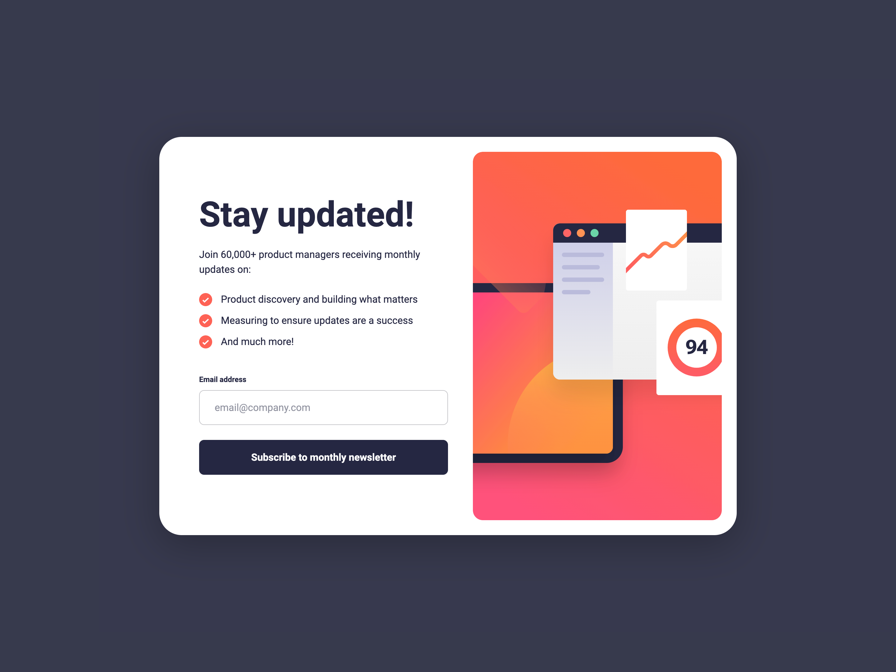

# Newsletter sign-up form

This is a solution to the [newsletter sign-up form with success message challenge on Frontend Mentor](https://www.frontendmentor.io/challenges/newsletter-signup-form-with-success-message-3FC1AZbNrv). Frontend Mentor challenges help you improve your coding skills by building realistic projects.

## Table of contents

- [The challenge](#the-challenge)
- [Screenshot](#screenshot)
- [Links](#links)
- [Built with](#built-with)
- [Author](#author)

## The challenge

- Add their email and submit the form
- See a success message with their email after successfully submitting the form
- See form validation messages if:
  - The field is left empty
  - The email address is not formatted correctly
- View the optimal layout for the interface depending on their device's screen size
- See hover and focus states for all interactive elements on the page

## Screenshot

## Links

- [Solution URL](https://github.com/annaindistress/frontend-mentor-newsletter-sign-up-form)
- [Live Site URL](https://annaindistress.github.io/frontend-mentor-newsletter-sign-up-form/)

## Built with

- Semantic HTML5 markup
- CSS Grid
- PostCSS
- Mobile-first workflow
- React
- Vite

## Author

- Frontend Mentor - [@annaindistress](https://www.frontendmentor.io/profile/annaindistress)
